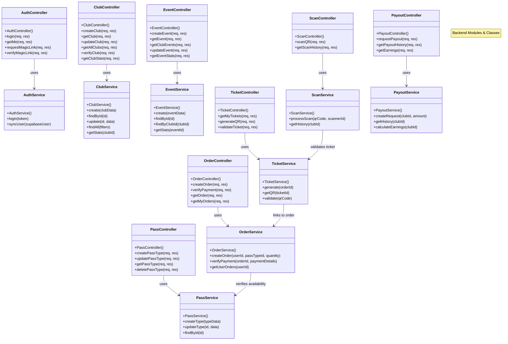

# Class Diagram - Backend Modules

```mermaid
classDiagram
    note "Backend Modules & Classes"

    class AuthController {
        +AuthController()
        +login(req, res)
        +getMe(req, res)
        +requestMagicLink(req, res)
        +verifyMagicLink(req, res)
    }

    class AuthService {
        +AuthService()
        +login(token)
        +syncUser(supabaseUser)
    }

    class ClubController {
        +ClubController()
        +createClub(req, res)
        +getClub(req, res)
        +updateClub(req, res)
        +getAllClubs(req, res)
        +verifyClub(req, res)
        +getClubStats(req, res)
    }

    class ClubService {
        +ClubService()
        +create(clubData)
        +findById(id)
        +update(id, data)
        +findAll(filters)
        +getStats(clubId)
    }

    class EventController {
        +EventController()
        +createEvent(req, res)
        +getEvent(req, res)
        +getClubEvents(req, res)
        +updateEvent(req, res)
        +getEventStats(req, res)
    }

    class EventService {
        +EventService()
        +create(eventData)
        +findById(id)
        +findByClubId(clubId)
        +getStats(eventId)
    }

    class PassController {
        +PassController()
        +createPassType(req, res)
        +updatePassType(req, res)
        +getPassType(req, res)
        +deletePassType(req, res)
    }

    class PassService {
        +PassService()
        +createType(typeData)
        +updateType(id, data)
        +findById(id)
    }
    
    class OrderController {
        +OrderController()
        +createOrder(req, res)
        +verifyPayment(req, res)
        +getOrder(req, res)
        +getMyOrders(req, res)
    }

    class OrderService {
        +OrderService()
        +createOrder(userId, passTypeId, quantity)
        +verifyPayment(orderId, paymentDetails)
        +getUserOrders(userId)
    }

    class TicketController {
        +TicketController()
        +getMyTickets(req, res)
        +generateQR(req, res)
        +validateTicket(req, res)
    }

    class TicketService {
        +TicketService()
        +generate(orderId)
        +getQR(ticketId)
        +validate(qrCode)
    }

    class ScanController {
        +ScanController()
        +scanQR(req, res)
        +getScanHistory(req, res)
    }

    class ScanService {
        +ScanService()
        +processScan(qrCode, scannerId)
        +getHistory(clubId)
    }

    class PayoutController {
        +PayoutController()
        +requestPayout(req, res)
        +getPayoutHistory(req, res)
        +getEarnings(req, res)
    }

    class PayoutService {
        +PayoutService()
        +createRequest(clubId, amount)
        +getHistory(clubId)
        +calculateEarnings(clubId)
    }

    AuthController --> AuthService : uses
    ClubController --> ClubService : uses
    EventController --> EventService : uses
    PassController --> PassService : uses
    OrderController --> OrderService : uses
    TicketController --> TicketService : uses
    ScanController --> ScanService : uses
    PayoutController --> PayoutService : uses

    OrderService --> PassService : verifies availability
    TicketService --> OrderService : links to order
    ScanService --> TicketService : validates ticket
```
