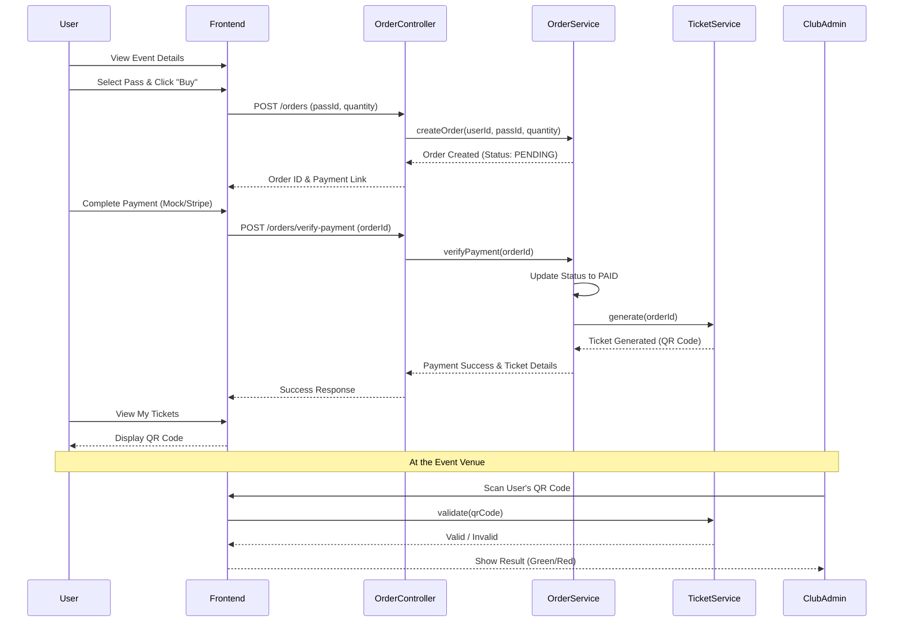

# Sequence Diagram - End-to-End Ticket Purchase & Scan

```mermaid
sequenceDiagram
    participant User
    participant Frontend
    participant OrderController
    participant OrderService
    participant TicketService
    participant ClubAdmin

    User->>Frontend: View Event Details
    User->>Frontend: Select Pass & Click "Buy"
    Frontend->>OrderController: POST /orders (passId, quantity)
    OrderController->>OrderService: createOrder(userId, passId, quantity)
    OrderService-->>OrderController: Order Created (Status: PENDING)
    OrderController-->>Frontend: Order ID & Payment Link

    User->>Frontend: Complete Payment (Mock/Stripe)
    Frontend->>OrderController: POST /orders/verify-payment (orderId)
    OrderController->>OrderService: verifyPayment(orderId)
    OrderService->>OrderService: Update Status to PAID
    OrderService->>TicketService: generate(orderId)
    TicketService-->>OrderService: Ticket Generated (QR Code)
    OrderService-->>OrderController: Payment Success & Ticket Details
    OrderController-->>Frontend: Success Response

    User->>Frontend: View My Tickets
    Frontend-->>User: Display QR Code

    Note over User, ClubAdmin: At the Event Venue

    ClubAdmin->>Frontend: Scan User's QR Code
    Frontend->>TicketService: validate(qrCode)
    TicketService-->>Frontend: Valid / Invalid
    Frontend-->>ClubAdmin: Show Result (Green/Red)
```
