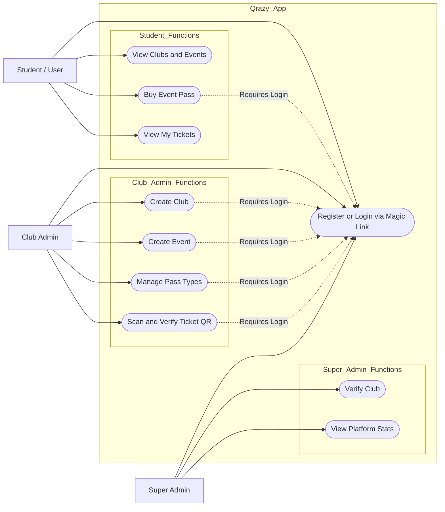

# Qrazy App – Use Case Flow

This document represents the structured Use Case Flow for the Qrazy App platform.

---

## Diagram

---

## Description

### Actors

- **Student / User**
- **Club Admin**
- **Super Admin**

---

### Core Authentication

All actors must register or login using a **Magic Link Authentication system** before accessing protected features.

---

### Student Capabilities

- View available clubs and events  
- Purchase event passes  
- View purchased tickets  

---

### Club Admin Capabilities

- Create and manage clubs  
- Create events  
- Configure pass types  
- Scan and verify QR-based tickets  

---

### Super Admin Capabilities

- Verify clubs  
- Monitor platform statistics  

---

## Notes

- Authentication is required for all transactional or administrative actions.
- The system boundary clearly separates platform logic from actors.
- This structure follows GitHub-compatible Mermaid flowchart format.
