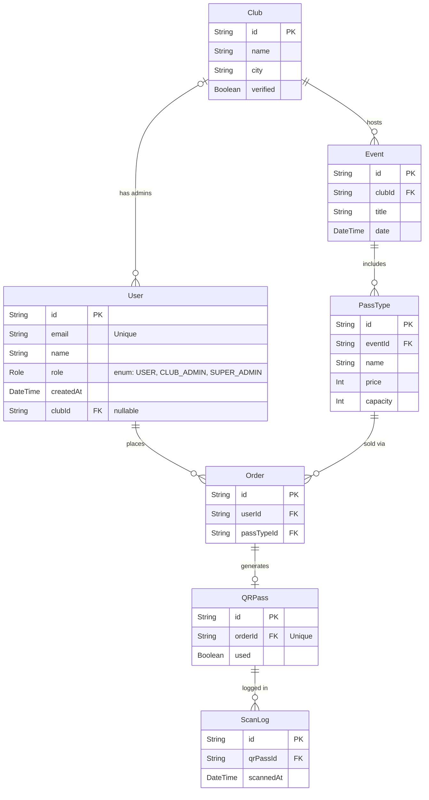

# Database Schema

This diagram represents the current database structure for the Qrazy Club Pass Marketplace.

```mermaid
erDiagram
    User {
        String id PK
        String email "Unique"
        String name
        Role role "enum: USER, CLUB_ADMIN, SUPER_ADMIN"
        DateTime createdAt
        String clubId FK "nullable"
    }

    Club {
        String id PK
        String name
        String city
        Boolean verified
    }

    Event {
        String id PK
        String clubId FK
        String title
        DateTime date
    }

    PassType {
        String id PK
        String eventId FK
        String name
        Int price
        Int capacity
    }

    Order {
        String id PK
        String userId FK
        String passTypeId FK
    }

    QRPass {
        String id PK
        String orderId FK "Unique"
        Boolean used
    }

    ScanLog {
        String id PK
        String qrPassId FK
        DateTime scannedAt
    }

    Club |o--o{ User : "has admins"
    Club ||--o{ Event : "hosts"
    
    Event ||--o{ PassType : "includes"
    
    User ||--o{ Order : "places"
    PassType ||--o{ Order : "sold via"
    
    Order ||--o| QRPass : "generates"
    
    QRPass ||--o{ ScanLog : "logged in"
```
