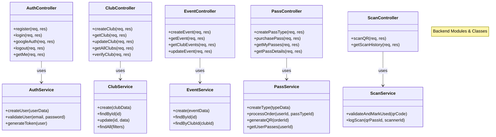
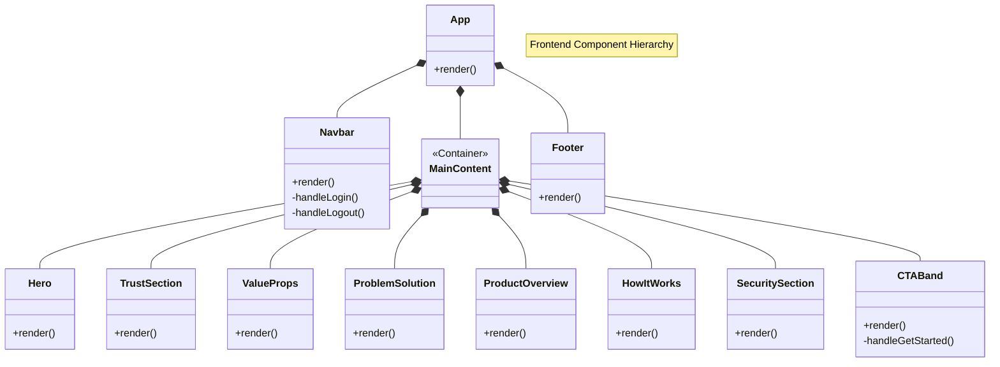

# Project Structure & UML Class Diagram

This document outlines the architectural structure of the Qrazy Club Pass Marketplace, including both the Backend (Node.js/Express) module design and the Frontend (React) component hierarchy.

## Backend Structure (Modules)

The backend is organized into functional modules. Each module contains a Controller (handling HTTP requests), a Service (business logic), and Routes.

## Frontend Structure (Components)

The frontend is built with React components, organized by feature and reusability.

