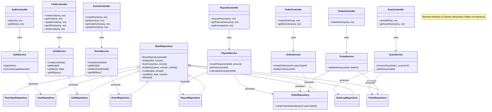

# Class Diagram - Backend Modules

```mermaid
classDiagram
    note "Backend Modules & Classes (Repository Pattern Architecture)"

    class BaseRepository {
        +BaseRepository(model)
        +findById(id, include)
        +findOne(where, include)
        +findMany(where, include, orderBy)
        +create(data, include)
        +update(id, data, include)
        +delete(id)
    }

    class UserRepository
    class ClubRepository
    class EventRepository
    class PassTypeRepository
    class OrderRepository {
        +createTransactional(userId, passTypeId)
    }
    class TicketRepository
    class ScanLogRepository
    class PayoutRepository

    BaseRepository <|-- UserRepository
    BaseRepository <|-- ClubRepository
    BaseRepository <|-- EventRepository
    BaseRepository <|-- PassTypeRepository
    BaseRepository <|-- OrderRepository
    BaseRepository <|-- TicketRepository
    BaseRepository <|-- ScanLogRepository
    BaseRepository <|-- PayoutRepository

    class AuthController {
        +login(req, res)
        +getMe(req, res)
    }

    class AuthService {
        +login(token)
        +syncUser(supabaseUser)
    }

    class ClubController {
        +createClub(req, res)
        +getClub(req, res)
        +updateClub(req, res)
        +getAllClubs(req, res)
        +verifyClub(req, res)
    }

    class ClubService {
        +create(clubData)
        +getById(id)
        +update(id, data)
        +getAll(query)
    }

    class EventController {
        +createEvent(req, res)
        +getEvent(req, res)
        +getClubEvents(req, res)
        +updateEvent(req, res)
    }

    class EventService {
        +create(eventData)
        +getById(id)
        +findByClubId(clubId)
        +getAll(filters)
    }
    
    class OrderController {
        +createOrder(req, res)
        +getMyOrders(req, res)
    }

    class OrderService {
        +createOrder(userId, passTypeId)
        +getMyOrders(userId)
    }

    class TicketController {
        +initializeEntry(req, res)
    }

    class TicketService {
        +initializeEntry(userId, orderId)
    }

    class ScanController {
        +scanQR(req, res)
        +getScanHistory(req, res)
    }

    class ScanService {
        +processScan(token, scannerId)
        +getHistory(clubId)
    }

    class PayoutController {
        +requestPayout(req, res)
        +getPayoutHistory(req, res)
        +getEarnings(req, res)
    }

    class PayoutService {
        +createRequest(clubId, amount)
        +getHistory(clubId)
        +calculateEarnings(clubId)
    }

    AuthController --> AuthService : uses
    ClubController --> ClubService : uses
    EventController --> EventService : uses
    OrderController --> OrderService : uses
    TicketController --> TicketService : uses
    ScanController --> ScanService : uses
    PayoutController --> PayoutService : uses

    AuthService --> UserRepository : accesses
    ClubService --> ClubRepository : accesses
    EventService --> EventRepository : accesses
    OrderService --> OrderRepository : accesses
    TicketService --> TicketRepository : accesses
    ScanService --> ScanLogRepository : accesses
    ScanService --> TicketRepository : accesses
    TicketService --> OrderRepository : accesses
    PayoutService --> PayoutRepository : accesses
    PayoutService --> OrderRepository : accesses
```
